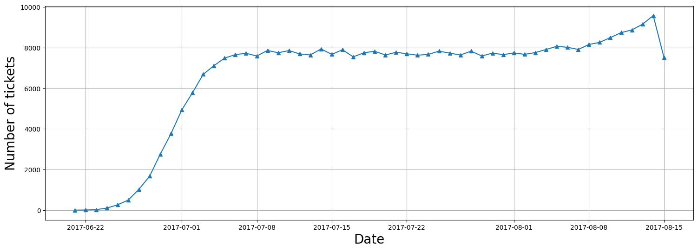
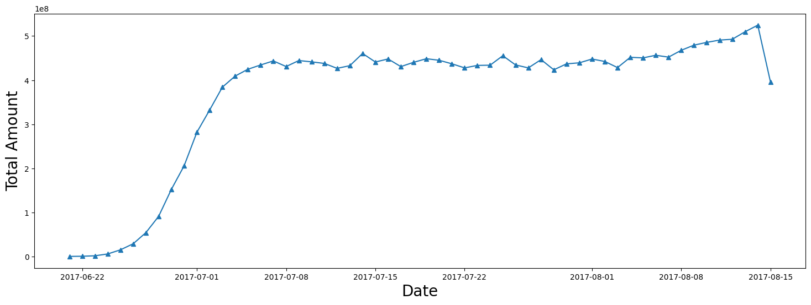

# 💳 AirLine Data Analysis
This project performs data analysis on a Airline  dataset to solve the challenges like stricter environmental regulations , higher flight taxes, increased interest rates,rising fuel prices etc.

## 📑 Table of Contents
- [Overview](#overview)
- [Business Problem](#business-problem)
- [Dataset](#dataset)
- [Tools & Technologies](#tools--technologies)
- [Project Structure](#project-structure)
- [Data Cleaning & Preparation](#data-cleaning--preparation)
- [Exploratory Data Analysis (EDA)](#exploratory-data-analysis-eda)
- [Research Questions & Key Findings](#research-questions--key-findings)
- [Dashboard](#dashboard)
- [How to Run This Project](#how-to-run-this-project)
- [Final Recommendations](#final-recommendations)

---

## 🔹 Project Overview
The goal of this data analysis project using SQL , Python would be to identify opportunities to increase the occupancy rate on low-performing flights ,which can ulimately lead to increased profitablity for the airline.
---

## 🔹 Business Problem
A airline company is currently facin a  challenges due to several factors such as stricter environmental regulations, higher flight taxes, increased interest rates,rising fuel prices and a tight labor market resulting in increased labor costs. As a result , the company's profitability is under pressure and they are seekin ways to address the issue to tackle this challenges.

---

## 🔹 Dataset
- Source of the dataset : https://www.kaggle.com/datasets/open-flights/airline-database

- Size, format, and key features/columns  : this is a database that contains different table related to airline industries like aircrafts_data,airports_data,boarding_passes,bookings , flights,seats,ticket_flights,tickets.

- Any preprocessing done before use  
1. create a DataBase connection using sqlite 
2. explore the table one by one using pandas function (read_sql_query).
---

## 🔹 Tools & Technologies
- Python 
- Sqlite3
- Numpy 
- Pandas 
- Matplotlib
- Seaborn

---

## 🔹 Project Structure

- /travel.sqlite               # Huge database, download through the link
- /Airline_Data_analysis.ipynb # Jupyter notebook for EDA and modeling
- /figure/                     # Visualizations
- /dashboard/                  # Dashboard-related files
- /README.md                   # Project documentation
- /.gitignore                  # Avoid tracking virtual environments

---

## 🔹 Data Cleaning & Preparation
Steps taken for:
- Handling missing values  : No Null values Found
- Checking Duplicates : No duplicate rows Found.
---

## 🔹Research Questions & Key Findings
- There is 5 Planes that have more than 100 seats.
- Number of tickets booked and total amount earned over time . 

- Calculate the average charges for each aircraft with different fare condition. 

- Calculate the total revenue per year and the average  revenue per ticket.

| aircraft_code | booked_seats | num_seats | occupancy_rate |
|---------------|--------------|-----------|----------------|
| 319           | 53.583181    | 116       | 0.461924       |
| 321           | 88.809231    | 170       | 0.522407       |
| 733           | 80.255462    | 130       | 0.617350       |
| 763           | 113.937294   | 222       | 0.513231       |
| 773           | 264.925806   | 402       | 0.659019       |

- How Much the total annual turnover could increase by giving all aircrafts a 10 % higher occupancy rate.

| aircraft_code | booked_seats | num_seats | occupancy_rate | inc_occupancy_rate |
|---------------|--------------|-----------|----------------|---------------------|
| 319           | 53.583181    | 116       | 0.461924       | 0.508116            |
| 321           | 88.809231    | 170       | 0.522407       | 0.574648            |
| 733           | 80.255462    | 130       | 0.617350       | 0.679085            |
| 763           | 113.937294   | 222       | 0.513231       | 0.564554            |
| 773           | 264.925806   | 402       | 0.659019       | 0.724921            |
---

## 🔹 Dashboard
We will add soon . 
---

## 🔹 How to Run This Project
Instructions for setup:
1. Clone the repository (git clone https://github.com/Sachin2095/Airline-SQL-DATASET.git) 
2. Install dependencies (`pip install -r requirements.txt`)  
3. Run Jupyter notebooks or scripts .
4. Open dashboard()  

---

## 🔹 Final Recommendations
1. Airlines can find areas for improvement and modify their pricing and route plans as a result of assessing these indicators.
2. A greater occupancy rate is one important feature that can enhance profitability since it allows airlines to maximize revenue while minimizing costs associated with vacent seats.
3. the airline should revise the price for earch aircraft as the lower price and high price is also the factor that people are not buying tickets  from those aircrafts .
4. They should decide the rasonable price according to the condition and facility of the aircraft and it should not be very cheap or high.

